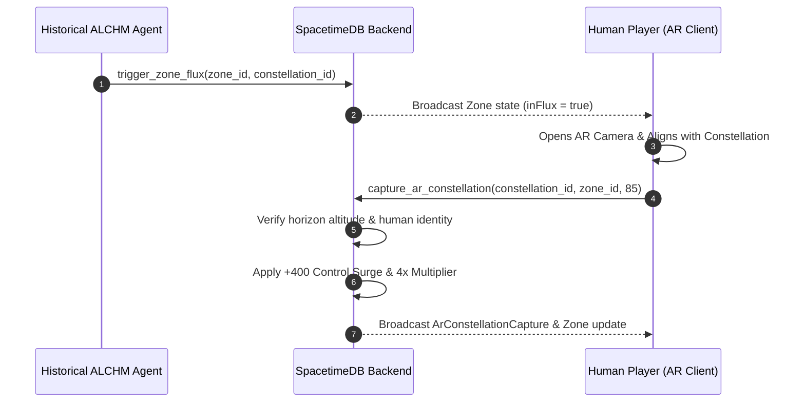

# Stitch UI Handoff Specification: Historical ALCHM Agents Zone Flux & Human AR Advantage

This document outlines the API specifications, database subscriptions, and UI/UX contracts for integrating the **Zone Flux** mechanics and **Human AR Constellation Capture** system into the Pentacles client application.

---

## 1. System Overview

- **Historical ALCHM Agents**: Autonomous backend agents (Newton, Paracelsus, Dee, Flamel, Hypatia, etc.) dynamically trigger **FLUX** on zones based on planetary ephemeris transits and astrological alignments.
- **Zone Flux**: When a zone enters FLUX, control velocity is multiplied (**2.5x**), making the zone volatile, contested, and highly lucrative.
- **Human AR Meta Advantage**: Human Seekers have decisive authority over bot agents. By opening the AR Camera and aligning their phone with the active constellation in the sky over a flux zone, humans trigger an **AR Capture**. This unlocks a **4x Human Meta Advantage** multiplier and pushes +400 instant control to their faction.

---

## 2. SpacetimeDB Table Subscriptions

### `zone` Table (Public)

Subscribe to `zone` table updates to render live zone states:

```typescript
export interface ZoneRow {
  zoneId: number;              // 0..10 (0..4 House, 5..9 Spire, 10 Crown)
  kind: "House" | "Spire" | "Crown";
  owner: string | null;        // Faction Planet ("Sun", "Moon", "Mars", etc.)
  control: number;             // -1000..+1000 tug-of-war meter
  updatedAt: number;
  inFlux: boolean;             // TRUE when zone is currently in FLUX
  fluxLevel: number;           // 0..100 intensity score
  fluxConstellation: number | null; // Constellation ID driving the flux
  fluxTriggeredBy: string | null;   // Identity of agent/trigger
  fluxExpiresAt: number | null;     // Expiry timestamp (microseconds)
}
```

### `ar_constellation_capture` Table (Public)

Subscribe to track active AR captures:

```typescript
export interface ArConstellationCaptureRow {
  captureId: number;
  player: string;             // SpacetimeDB Identity hex
  constellationId: number;
  zoneId: number;
  precisionScore: number;     // 0..100 precision alignment score from AR camera
  capturedAt: number;
  expiresAt: number;
}
```

---

## 3. Reducer Call Contracts

### A. Human AR Constellation Capture (`capture_ar_constellation`)

Call this reducer when a human user successfully aligns their camera with a constellation in AR mode:

```typescript
// Call via SpacetimeDB Client SDK
await spacetime.callReducer("capture_ar_constellation", [
  constellationId, // u16: ID of the constellation (e.g. 1 for Orion)
  zoneId,          // u8: Target zone ID (0..10)
  precisionScore   // u8: Calculated AR alignment score (must be >= 70)
]);
```

**Effects**:
- Validates player identity is human (rejects bot agents).
- Verifies constellation member stars are above player's physical horizon (`altitude_deg >= 10.0`).
- Inserts `ArConstellationCapture` record valid for 1 hour.
- Immediately pushes **+400 Control** for player's faction in that zone.
- Grants **4x multiplier** to all subsequent card deployments and duels in that zone while capture is active.

### B. Trigger Zone Flux (`trigger_zone_flux`)

Called by historical agent services (or admin CLI):

```typescript
await spacetime.callReducer("trigger_zone_flux", [
  zoneId,          // u8
  constellationId, // u16
  intensity,       // u8 (1..100)
  durationSecs     // u64 (seconds, e.g. 1800)
]);
```

---

## 4. UI / UX Design Requirements for Stitch

1. **Zone Map / HUD**:
   - Highlight zones currently `inFlux === true` with vibrant aura animations, glowing celestial borders, and active constellation icons.
   - Display countdown timer remaining based on `fluxExpiresAt`.

2. **AR Camera Overlay View**:
   - Access device camera stream and gyroscope/orientation (`DeviceOrientationEvent`).
   - Draw constellation lines (from `constellation_line` and `star_node` tables) overlaying the live camera feed according to computed azimuth and altitude.
   - Calculate precision alignment score:
     $$\text{precision} = \max(0, 100 - \text{angular\_offset\_deg} \times 10)$$
   - Show lock-on reticle that turns gold/green when precision $\ge 70\%$.
   - Tap-to-capture button invoking `capture_ar_constellation`.

3. **Meta Advantage Status Badge**:
   - Render a glowing **"HUMAN AR SURGE 4X"** badge on the HUD when the user has an active `ArConstellationCapture` for the selected zone.

---

## 5. End-to-End Flow Summary


